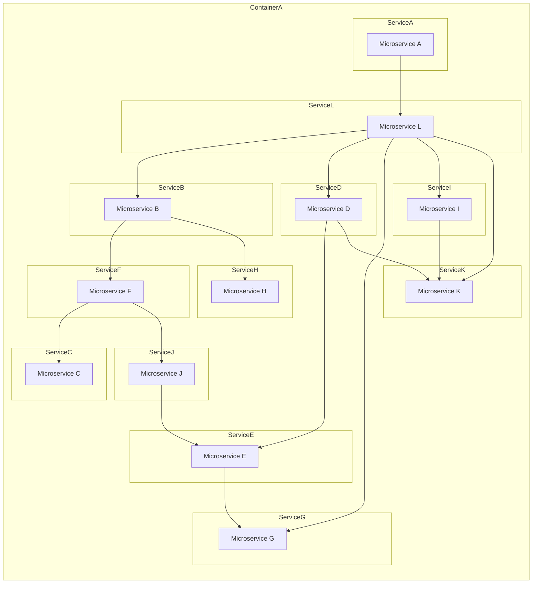

# Architecture 1 - 3_microservices_fine_granularity

This folder was generated automatically.

- Config file: `config.json`
- Graph source: generated microservice dependencies

```mermaid
graph TD
    subgraph ContainerA [ContainerA]
        direction TD
        subgraph ServiceA [ServiceA]
            direction TD
            MA[Microservice A]
        end
        subgraph ServiceB [ServiceB]
            direction TD
            MB[Microservice B]
        end
        subgraph ServiceC [ServiceC]
            direction TD
            MC[Microservice C]
        end
        subgraph ServiceD [ServiceD]
            direction TD
            MD[Microservice D]
        end
        subgraph ServiceE [ServiceE]
            direction TD
            ME[Microservice E]
        end
        subgraph ServiceF [ServiceF]
            direction TD
            MF[Microservice F]
        end
        subgraph ServiceG [ServiceG]
            direction TD
            MG[Microservice G]
        end
        subgraph ServiceH [ServiceH]
            direction TD
            MH[Microservice H]
        end
        subgraph ServiceI [ServiceI]
            direction TD
            MI[Microservice I]
        end
        subgraph ServiceJ [ServiceJ]
            direction TD
            MJ[Microservice J]
        end
        subgraph ServiceK [ServiceK]
            direction TD
            MK[Microservice K]
        end
        subgraph ServiceL [ServiceL]
            direction TD
            ML[Microservice L]
        end
    end

    MA --> ML
    MB --> MF
    MB --> MH
    MD --> ME
    MD --> MK
    ME --> MG
    MF --> MC
    MF --> MJ
    MI --> MK
    MJ --> ME
    ML --> MB
    ML --> MD
    ML --> MG
    ML --> MI
    ML --> MK
```
