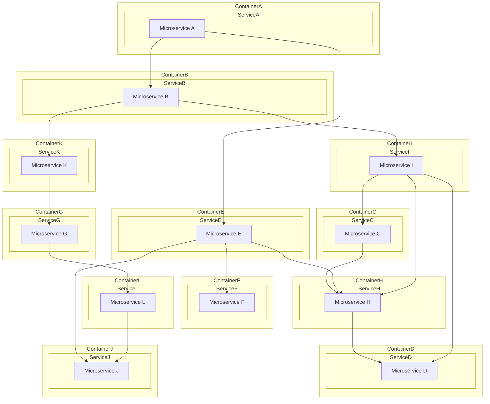

# Architecture 7 - 6_microservices_fine_granularity_high_isolation

This folder was generated automatically.

- Config file: `config.json`
- Graph source: generated microservice dependencies

```mermaid
graph TD
    subgraph ContainerA [ContainerA]
        direction TD
        subgraph ServiceA [ServiceA]
            direction TD
            MA[Microservice A]
        end
    end
    subgraph ContainerB [ContainerB]
        direction TD
        subgraph ServiceB [ServiceB]
            direction TD
            MB[Microservice B]
        end
    end
    subgraph ContainerC [ContainerC]
        direction TD
        subgraph ServiceC [ServiceC]
            direction TD
            MC[Microservice C]
        end
    end
    subgraph ContainerD [ContainerD]
        direction TD
        subgraph ServiceD [ServiceD]
            direction TD
            MD[Microservice D]
        end
    end
    subgraph ContainerE [ContainerE]
        direction TD
        subgraph ServiceE [ServiceE]
            direction TD
            ME[Microservice E]
        end
    end
    subgraph ContainerF [ContainerF]
        direction TD
        subgraph ServiceF [ServiceF]
            direction TD
            MF[Microservice F]
        end
    end
    subgraph ContainerG [ContainerG]
        direction TD
        subgraph ServiceG [ServiceG]
            direction TD
            MG[Microservice G]
        end
    end
    subgraph ContainerH [ContainerH]
        direction TD
        subgraph ServiceH [ServiceH]
            direction TD
            MH[Microservice H]
        end
    end
    subgraph ContainerI [ContainerI]
        direction TD
        subgraph ServiceI [ServiceI]
            direction TD
            MI[Microservice I]
        end
    end
    subgraph ContainerJ [ContainerJ]
        direction TD
        subgraph ServiceJ [ServiceJ]
            direction TD
            MJ[Microservice J]
        end
    end
    subgraph ContainerK [ContainerK]
        direction TD
        subgraph ServiceK [ServiceK]
            direction TD
            MK[Microservice K]
        end
    end
    subgraph ContainerL [ContainerL]
        direction TD
        subgraph ServiceL [ServiceL]
            direction TD
            ML[Microservice L]
        end
    end

    MA --> MB
    MA --> ME
    MB --> MI
    MB --> MK
    MC --> MH
    ME --> MF
    ME --> MH
    ME --> MJ
    MG --> ML
    MH --> MD
    MI --> MC
    MI --> MD
    MI --> MH
    MK --> MG
    ML --> MJ
```
