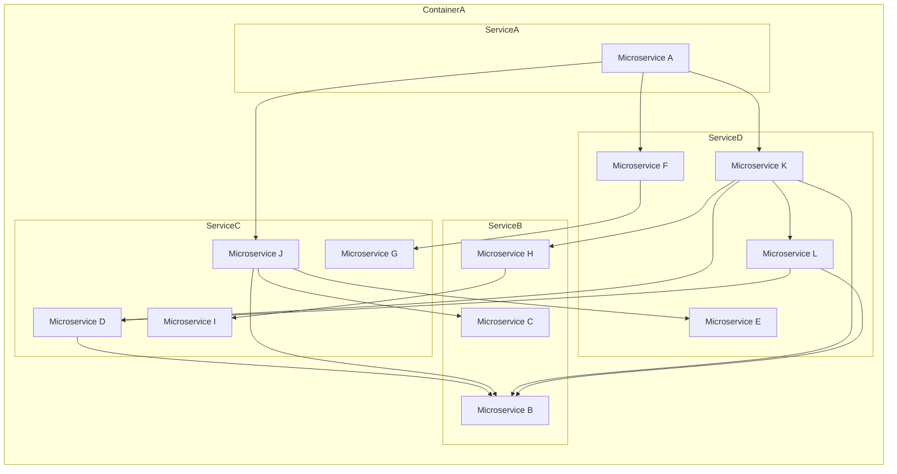

# Architecture 8 - 2_microservices_medium_granularity

This folder was generated automatically.

- Config file: `config.json`
- Graph source: generated microservice dependencies

```mermaid
graph TD
    subgraph ContainerA [ContainerA]
        direction TD
        subgraph ServiceA [ServiceA]
            direction TD
            MA[Microservice A]
        end
        subgraph ServiceB [ServiceB]
            direction TD
            MB[Microservice B]
            MC[Microservice C]
            MH[Microservice H]
        end
        subgraph ServiceC [ServiceC]
            direction TD
            MG[Microservice G]
            MI[Microservice I]
            MJ[Microservice J]
            MD[Microservice D]
        end
        subgraph ServiceD [ServiceD]
            direction TD
            ME[Microservice E]
            MF[Microservice F]
            MK[Microservice K]
            ML[Microservice L]
        end
    end

    MA --> MF
    MA --> MJ
    MA --> MK
    MD --> MB
    MF --> MG
    MH --> MI
    MJ --> MB
    MJ --> MC
    MJ --> ME
    MK --> MB
    MK --> MD
    MK --> MH
    MK --> ML
    ML --> MB
    ML --> MD
```
