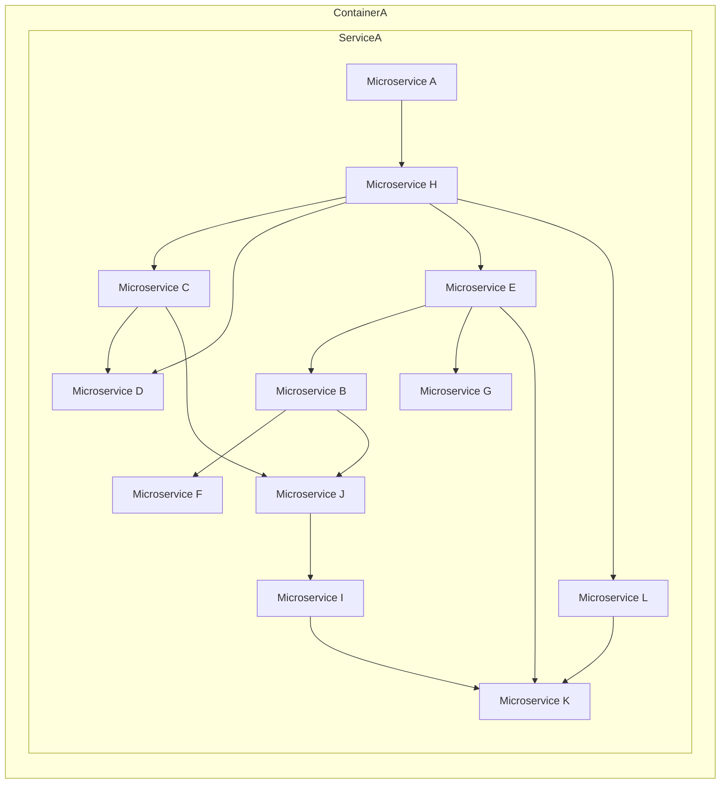

# Architecture 10 - 1_monolithic

This folder was generated automatically.

- Config file: `config.json`
- Graph source: generated microservice dependencies

```mermaid
graph TD
    subgraph ContainerA [ContainerA]
        direction TD
        subgraph ServiceA [ServiceA]
            direction TD
            MA[Microservice A]
            MB[Microservice B]
            MC[Microservice C]
            MD[Microservice D]
            ME[Microservice E]
            MF[Microservice F]
            MG[Microservice G]
            MH[Microservice H]
            MI[Microservice I]
            MJ[Microservice J]
            MK[Microservice K]
            ML[Microservice L]
        end
    end

    MA --> MH
    MB --> MF
    MB --> MJ
    MC --> MD
    MC --> MJ
    ME --> MB
    ME --> MG
    ME --> MK
    MH --> MC
    MH --> MD
    MH --> ME
    MH --> ML
    MI --> MK
    MJ --> MI
    ML --> MK
```
