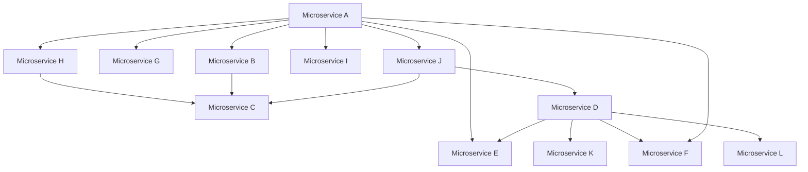
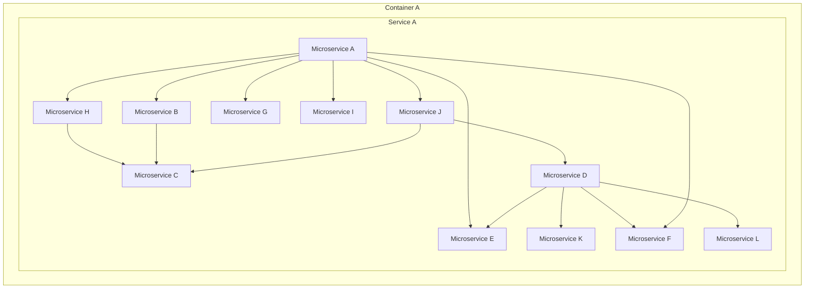
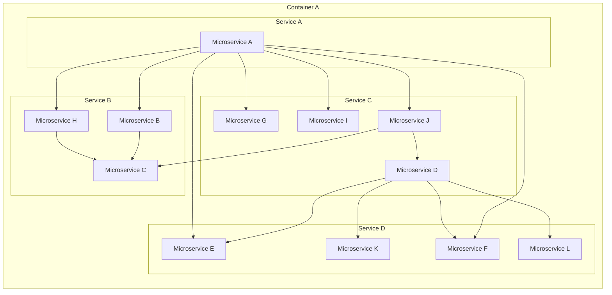
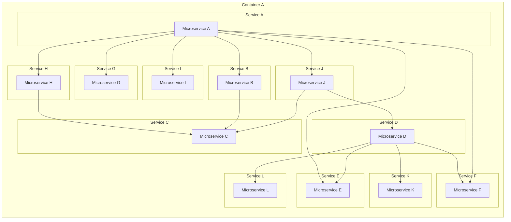
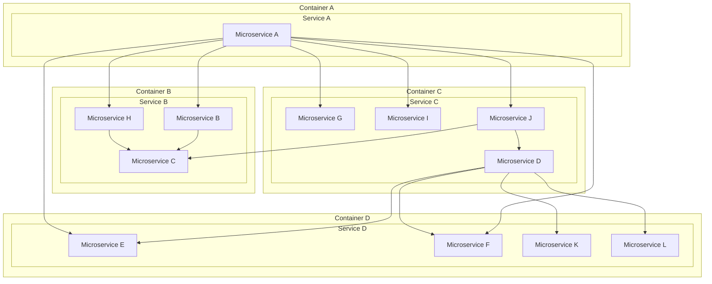
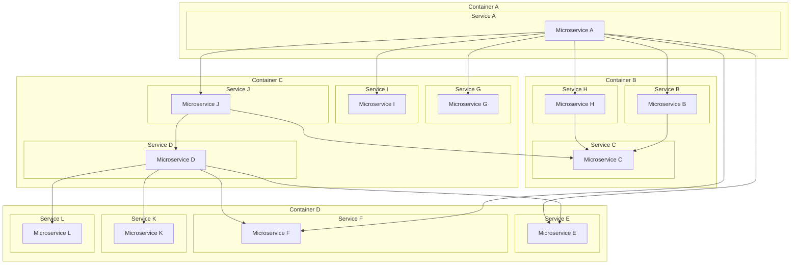
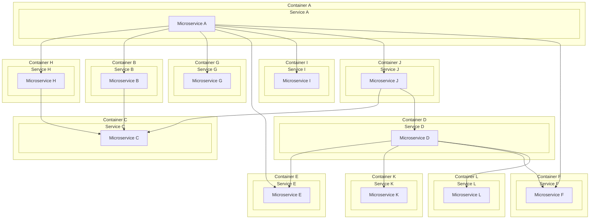

List of all configurations available in the project. Each configuration is defined in a separate file and can be used to set up different environments or scenarios for the application.

⚠️ All this configurations intend to be used for testing purposes. In the study version, configurations may be generated randomly.

Each container definition can set `cpuLimit` to control the CPU cap emitted in the generated Docker Compose file.

granularity :

- fine : each microservice is in its own service definition in the compose file, with its own resource limits and logs.
- medium : microservices are grouped into services with 1-4 microservices each, with shared resource limits and logs per service.
- coarse : all microservices are in a single service definition in the compose file, with shared resource limits and logs.

isolation :

- none : all microservices run in the same container, no isolation.
- medium : containers are defined per service (for medium granularity) or group 1-4 services, providing some isolation
- high : each services (coarse granularity, service run one microservice) run in its own container, providing high isolation but more overhead.

# Microservices dependency graph

There are 12 microservices in the application.

# Configuration 1 : Monolithic Application, coarse granularity, no isolation

**File Name**: `1_monolithic.config.json`

Microservices configuration :

# Configuration 2 : Microservices with medium granularity, no isolation

**File Name**: `2_microservices_medium_granularity.config.json`

Microservices configuration :

# Configuration 3 : Microservices with fine granularity, no isolation

**File Name**: `3_microservices_fine_granularity.config.json`

Microservices configuration :

# Configuration 4 : Microservices with medium granularity, with medium isolation

**File Name**: `4_microservices_medium_granularity_isolation.config.json`

Microservices configuration :

# Configuration 5 : Microservices with fine granularity, with medium isolation

**File Name**: `5_microservices_fine_granularity_isolation.config.json`

Microservices configuration :

# Configuration 6 : Microservices with fine granularity, with high isolation

**File Name**: `6_microservices_fine_granularity_high_isolation.config.json`

Microservices configuration :

